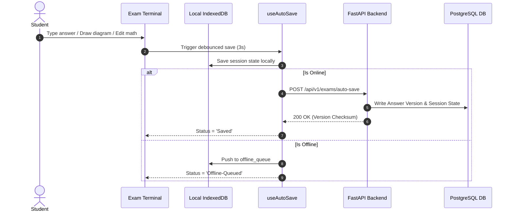
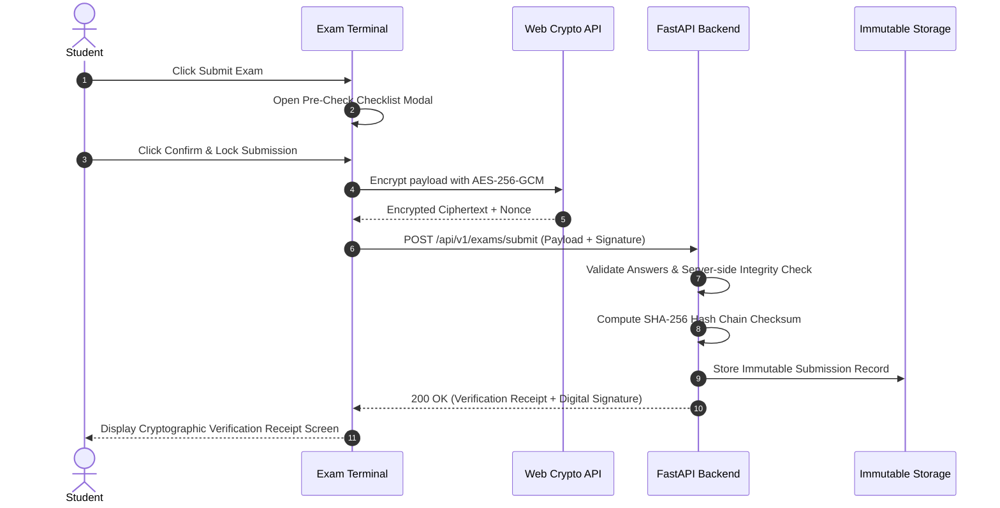
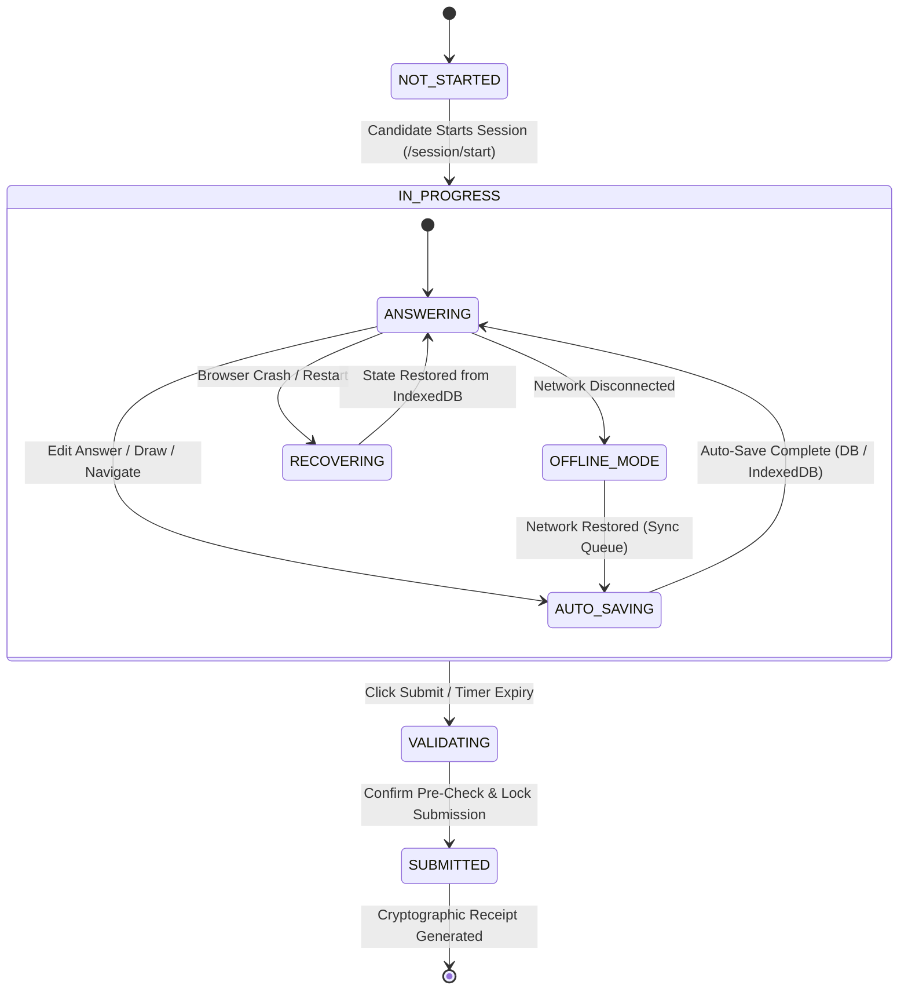

# AI Board Examination Operating System (AIBOS)

> **AIBOS** is an enterprise-grade digital public infrastructure designed to replace traditional paper-based board exams (State Boards, CBSE, ICSE, Universities, Government Recruitment) with an autonomous, crash-resilient AI examination, edge proctoring, multi-agent evaluation, and cryptographic credential ecosystem for millions of students.

---

## 🚀 Key Implemented Modules

### Module 1 & 2: Identity, Access & School Management
- **Multi-Role RBAC:** JWT authentication supporting `STUDENT`, `TEACHER`, `SCHOOL_ADMIN`, `BOARD_OFFICIAL`, `SUPER_ADMIN`.
- **Institutional Mapping:** School registration, candidate roll numbers, class level, and section assignments.

### Module 3: Enterprise Question Bank System
- **Bloom's Taxonomy Tagging:** Remember, Understand, Apply, Analyze, Evaluate, Create.
- **Difficulty Index:** Normalized difficulty scoring ($0.0 - 1.0$), expected time, model answers, LaTeX formulas, vector diagram metadata, and step-wise rubrics.

### Module 5: Production Examination Engine (Milestone 2 Completed)
1. **Intelligent Auto-Save (`useAutoSave` Hook):**
   - Debounced auto-saving every 3 seconds.
   - Immediate trigger on question switches, equation edits, canvas drawing updates, and before tab unload.
   - Exponential backoff retries and offline queueing.
2. **Crash & Restart Recovery Engine:**
   - Client-side IndexedDB persistence (`AIBOS_Exam_Storage`).
   - Auto-restores candidate typed answers, math equations, vector drawings, countdown timer, active section, scroll position, and question palette states after browser crash, power failure, or device restart.
3. **Offline Mode & Background Synchronization:**
   - Seamless offline examination execution without network latency.
   - Automatic background synchronization when connectivity is restored.
   - Visual network status indicator (`Online` / `Offline Mode`).
4. **Secure Cryptographic Submission Pipeline:**
   - Client-side AES-256-GCM answer payload encryption via Web Crypto API.
   - SHA-256 Hash Chain Checksum generation binding submission data to candidate roll number and timestamp.
   - ECDSA-P256 digital signature signing.
   - Immutable verification receipt generation.
5. **Activity & Audit Event Logging:**
   - Tracks `EXAM_START`, `QUESTION_SWITCH`, `AUTO_SAVE`, `NETWORK_OFFLINE`, `NETWORK_ONLINE`, `TAB_SWITCH`, `DEVTOOLS_HOTKEY`, `RIGHT_CLICK_ATTEMPT`, `CLIPBOARD_ATTEMPT`, `REFRESH_HOTKEY`, and `EXAM_SUBMIT`.
6. **Answer Version History:**
   - Tracks version numbers (`v1`, `v2`, ...), timestamps, answer snapshots, and edit reasons. Allows students to inspect and revert to prior versions.
7. **Enhanced Vector Drawing Canvas (`Fabric.js`):**
   - Undo/Redo history stack, Zoom (+/-), Pan tool, Pen, Eraser, Line, Arrow, Rectangle, Circle, Text Label, Grid overlay, Snap to Grid, Ruler guide, Export PNG, and keyboard shortcuts (`Ctrl+Z`, `Ctrl+Y`).
8. **Real-time Production Header Dashboard (`ExamHeader`):**
   - Remaining time countdown, battery level monitoring (`navigator.getBattery()`), auto-save status feedback, network status, progress %, and submission pre-check modal.
9. **Exam Lockdown Security Guard (`ExamLockdownGuard`):**
   - Blocks copy, cut, paste, right-click context menu, DevTools hotkeys (`F12`, `Ctrl+Shift+I`), tab switches, and browser refresh.

---

## 📊 Sequence Diagrams

### 1. Auto-Save & Offline Sync Flow


### 2. Secure Cryptographic Submission Flow


---

## 🔄 Exam Session State Machine



---

## 💻 Tech Stack

- **Frontend:** Next.js 14 (App Router), React 18, TypeScript, TailwindCSS, MathLive, Fabric.js, Lucide Icons, Web Crypto API.
- **Backend:** Python 3.11/3.14, FastAPI, SQLAlchemy 2, Pydantic v2, PostgreSQL, Redis, MinIO S3, Cryptography (Hazmat AESGCM).
- **Testing & Infra:** Docker, Docker Compose, Pytest, Uvicorn.

---

## ⚡ Quick Start

### 1. Backend Setup
```bash
python3 -m venv .venv
source .venv/bin/activate
pip install -r backend/requirements.txt

# Launch FastAPI backend service
PYTHONPATH=backend uvicorn app.main:app --host 0.0.0.0 --port 8000
```
API Documentation available at: `http://localhost:8000/docs`

### 2. Frontend Setup
```bash
cd frontend
npm install
npm run dev
```
Exam Terminal available at: `http://localhost:3000/exam/physics-101`

### 3. Run Automated Tests
```bash
# Run pytest backend test suite
PYTHONPATH=backend .venv/bin/pytest backend/tests/

# Run frontend TypeScript compilation check
cd frontend && npx tsc --noEmit
```

---

## 📜 License

Enterprise Licensed • Government Digital Public Infrastructure for Board Examinations
