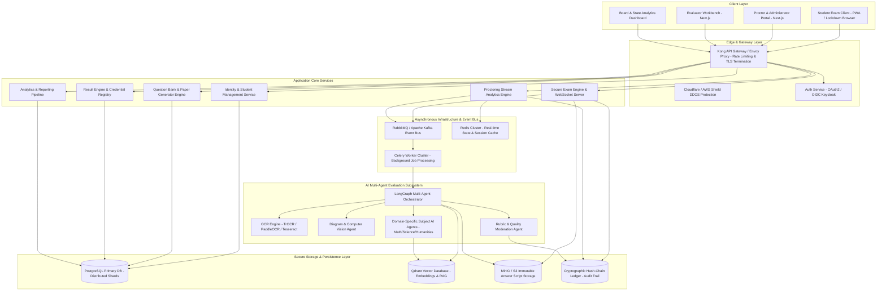
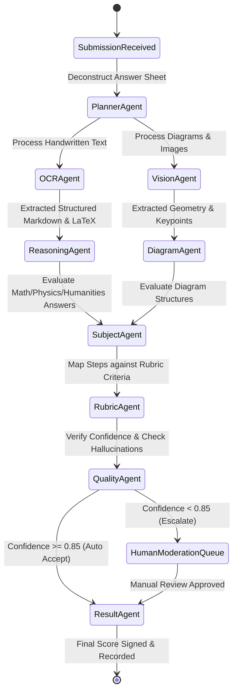

# Master Architecture Specification & Implementation Plan
## AI Board Examination Operating System (AIBOS)

> **System Purpose:** Enterprise-grade, government-scale digital examination and evaluation platform designed to replace traditional board exams (State Boards, CBSE, ICSE, Universities, Government Recruitment) supporting 10+ million students and 500,000 concurrent examination sessions with zero single points of failure.

---

## 1. Executive Architectural Overview & High-Level System Topology

AIBOS is structured as a resilient, high-concurrency, microservices-driven architecture with an asynchronous event-driven core and a Multi-Agent AI evaluation engine.



### Key Architectural Attributes
1. **High Concurrency Scale (500k active sessions):** 
   - State-less API backends powered by FastAPI running on Python 3.11 with `uvloop`.
   - Client-side offline-first architecture for exam execution with background delta-synced WebSocket and HTTP auto-saves.
2. **Zero-Trust Security & Tamper Proofing:**
   - Client-side payloads encrypted with AES-256-GCM prior to transmission.
   - Digitally signed student submissions using asymmetric cryptography (ECDSA P-256).
   - Immutable SHA-256 hash chains for all answer scripts and evaluation score sheets.
3. **Multi-Agent Evaluation Framework:**
   - Graph-based orchestration using `LangGraph` for deterministic, auditable multi-agent collaboration.
   - Dedicated subject-matter reasoning agents combined with OCR and diagram vision networks.
   - Human-in-the-loop escalation paths for low-confidence evaluations ($< 85\%$).

---

## 2. Deep Dive System Modules (Modules 1 – 14)

### Module 1: Identity & Access Management (IAM)
- **Role-Based & Attribute-Based Access Control (RBAC/ABAC):** Roles include `STUDENT`, `TEACHER`, `SCHOOL_ADMIN`, `DISTRICT_OFFICER`, `EVALUATOR`, `BOARD_OFFICIAL`, `SUPER_ADMIN`.
- **Authentication Standards:** OAuth2 / OIDC integration supporting JWT tokens signed with RS256 algorithm.
- **Single Sign-On (SSO):** Enterprise SSO connector supporting SAML 2.0 / OpenID Connect for government portal integration.
- **Audit Logging:** Immutable append-only log capturing `user_id`, `ip_address`, `action`, `resource_id`, `timestamp`, and `signature`.

### Module 2: Student Management & Enrollment
- **Registration & Verification:** Student profile lifecycle, biometric feature hash storage, school-district-state hierarchical mappings.
- **Hall Ticket Generation:** Secure PDF generation with embedded QR codes containing cryptographically signed payload verification links.

### Module 3: Question Bank System
- **Taxonomy & Metadata:** Bloom's Taxonomy tagging (Remember, Understand, Apply, Analyze, Evaluate, Create), subject, chapter, topic, difficulty index ($0.0 - 1.0$), expected response time.
- **Rich Content Support:** LaTeX equation parsing (`MathLive` compatible format), vector graphics SVG support, diagram metadata, model answers, step-by-step scoring rubrics with keyword weights.
- **Versioning Control:** Full audit history of question edits with version rollback capabilities.

### Module 4: Question Paper Generator
- **Algorithmic Paper Assembly:** Constraint Satisfaction Solver balancing chapter weightage, difficulty distribution, question types (MCQ, Short Answer, Long Essay, Diagram, Coding), total marks, and timing.
- **Anti-Duplication & Out-of-Syllabus Guard:** Qdrant vector similarity check ($\text{cosine similarity} < 0.85$) against historical papers to eliminate question duplication and detect out-of-syllabus content.
- **Workflow Approval Engine:** Multi-stage teacher/board committee approval workflow with digital signatures.

### Module 5: Secure Exam Engine (Frontend & Backend Terminal)
- **Interactive Input Editors:**
  - **Text Editor:** Rich text capabilities with markdown rendering.
  - **Formula Editor:** `MathLive` component emitting raw LaTeX and clean visual equations.
  - **Diagram Canvas:** `Fabric.js` based vector canvas allowing drawing, labeling, geometric shapes, and export to SVG/PNG.
  - **Code Sandbox:** Embedded `Monaco Editor` for programming questions supporting syntax highlighting and test case execution.
- **Resilience Engine:** Local `IndexedDB` continuous auto-save; instant recovery from power outages or network disconnections; differential delta uploads.

### Module 6: AI Proctoring System
- **Dual-Tier Detection Pipeline:**
  - *Tier 1 (Client Edge):* MediaPipe / TensorFlow.js running in client browser for low-latency gaze tracking, face count verification, and tab-focus detection.
  - *Tier 2 (Backend AI Cluster):* Server-side YOLOv8 & Vision Transformers for object detection (mobile phones, secondary screens, paper cheat sheets), multi-person detection, and voice/background speech analysis.
- **Real-Time Proctor Dashboard:** Web-RTC stream aggregation, dynamic risk scoring ($0-100$), real-time flag creation, and evidence video clip generation stored in S3/MinIO.

### Module 7: Answer Storage & Immutability Ledger
- **Storage Strategy:** Encrypted MinIO/S3 object storage for raw student responses, rendering assets, and audio/video proctoring logs.
- **Integrity Guarantee:** Every submitted answer sheet generates a SHA-256 cryptographic digest linked into a block-chain hash ledger to prevent unauthorized backend alterations.

### Module 8: Multilingual OCR Engine
- **Recognition Stack:** Ensemble engine utilizing `TrOCR` (Transformer-based OCR) for handwritten scripts, `PaddleOCR` for printed text and structured tables, and `Tesseract` fallback.
- **Language Support:** English, Hindi (Devanagari script), regional Indian languages, mathematical expressions (LaTeX conversion), and tabular content layout parsing.

### Module 9: Diagram Understanding & Vision Evaluation Engine
- **Computer Vision Pipeline:** ResNet/ViT feature extraction combined with graph match networks for evaluating student-drawn diagrams against canonical reference diagrams.
- **Domain Capabilities:** Biology (anatomical structures), Physics (circuit diagrams, ray diagrams), Chemistry (chemical structures, lab setups), Geography (maps, contour lines), Engineering (flowcharts, block diagrams).

### Module 10: Multi-Agent AI Evaluation Engine
- **LangGraph Multi-Agent Topology:**
  - **Planner Agent:** Deconstructs answer sheet into question-answer pairs and routes to specialized subject agents.
  - **OCR & Vision Agents:** Translates handwritten text and diagrams into structured semantic tokens.
  - **Subject Reasoner Agents (Math, Physics, Chemistry, Biology, Humanities, Language, Programming):** Evaluates response step-by-step against model answers and rubric criteria.
  - **Rubric Matcher & Quality Moderation Agent:** Validates point assignment, verifies citations, checks for hallucinations, and calculates confidence metrics.
  - **Result Aggregator Agent:** Finalizes itemized marks and generates natural language explainability reports for human reviewers.

### Module 11: Result Engine & Credential Registry
- **Computation Core:** Fast vectorized grading matrix, CGPA, percentage, district/state ranking, and percentile calculation.
- **Digital Certificates:** W3C Verifiable Credentials compliant Marksheets/Certificates with QR verification and PKI signatures.

### Module 12: Board Analytics & Insights Platform
- **Analytics Portals:** Dashboards for Students, Teachers, Schools, Districts, and State Educational Boards.
- **Item Response Theory (IRT):** Question discrimination index ($a$), difficulty index ($b$), guessing parameter ($c$).
- **Heatmaps & Diagnostics:** District-wise performance heatmaps, learning outcome gaps, and fraud pattern detection.

### Module 13: Distributed Notification Bus
- **Multi-Channel Dispatcher:** RabbitMQ message bus triggering Celery workers to dispatch SMS, Email, Push Notifications, and WhatsApp API alerts.

### Module 14: Government & Open Ecosystem Integration
- **Interoperability APIs:** Open API standards for DigiLocker document push/pull, Academic Bank of Credits (ABC) credit transfer API, and School/Board ERP adapters.

---

## 3. Database Schema Design (PostgreSQL ER Diagram Blueprint)

```sql
-- Core Schema DDL Overview

CREATE TABLE identity_users (
    id UUID PRIMARY KEY DEFAULT gen_random_uuid(),
    username VARCHAR(100) UNIQUE NOT NULL,
    email VARCHAR(255) UNIQUE NOT NULL,
    password_hash VARCHAR(255) NOT NULL,
    role VARCHAR(50) NOT NULL,
    is_active BOOLEAN DEFAULT TRUE,
    created_at TIMESTAMP WITH TIME ZONE DEFAULT CURRENT_TIMESTAMP,
    updated_at TIMESTAMP WITH TIME ZONE DEFAULT CURRENT_TIMESTAMP
);

CREATE TABLE schools (
    id UUID PRIMARY KEY DEFAULT gen_random_uuid(),
    code VARCHAR(50) UNIQUE NOT NULL,
    name VARCHAR(255) NOT NULL,
    district VARCHAR(100) NOT NULL,
    state VARCHAR(100) NOT NULL,
    created_at TIMESTAMP WITH TIME ZONE DEFAULT CURRENT_TIMESTAMP
);

CREATE TABLE students (
    id UUID PRIMARY KEY DEFAULT gen_random_uuid(),
    user_id UUID REFERENCES identity_users(id) ON DELETE CASCADE,
    school_id UUID REFERENCES schools(id),
    roll_number VARCHAR(50) UNIQUE NOT NULL,
    full_name VARCHAR(255) NOT NULL,
    class_level VARCHAR(20) NOT NULL,
    section VARCHAR(10) NOT NULL,
    biometric_hash TEXT,
    created_at TIMESTAMP WITH TIME ZONE DEFAULT CURRENT_TIMESTAMP
);

CREATE TABLE question_bank (
    id UUID PRIMARY KEY DEFAULT gen_random_uuid(),
    subject VARCHAR(100) NOT NULL,
    chapter VARCHAR(150) NOT NULL,
    topic VARCHAR(150),
    bloom_level VARCHAR(50) NOT NULL, -- Remember, Understand, Apply, Analyze, Evaluate, Create
    difficulty_score NUMERIC(3,2) CHECK (difficulty_score BETWEEN 0.0 AND 1.0),
    question_type VARCHAR(50) NOT NULL, -- MCQ, SHORT, LONG, DIAGRAM, CODE
    question_text TEXT NOT NULL,
    model_answer TEXT NOT NULL,
    rubric_json JSONB NOT NULL,
    expected_time_seconds INT NOT NULL,
    version INT DEFAULT 1,
    created_by UUID REFERENCES identity_users(id),
    created_at TIMESTAMP WITH TIME ZONE DEFAULT CURRENT_TIMESTAMP
);

CREATE TABLE exams (
    id UUID PRIMARY KEY DEFAULT gen_random_uuid(),
    title VARCHAR(255) NOT NULL,
    subject VARCHAR(100) NOT NULL,
    total_marks INT NOT NULL,
    duration_minutes INT NOT NULL,
    start_time TIMESTAMP WITH TIME ZONE NOT NULL,
    end_time TIMESTAMP WITH TIME ZONE NOT NULL,
    blueprint_config JSONB NOT NULL,
    status VARCHAR(50) DEFAULT 'DRAFT', -- DRAFT, PUBLISHED, LIVE, COMPLETED
    created_at TIMESTAMP WITH TIME ZONE DEFAULT CURRENT_TIMESTAMP
);

CREATE TABLE exam_questions (
    id UUID PRIMARY KEY DEFAULT gen_random_uuid(),
    exam_id UUID REFERENCES exams(id) ON DELETE CASCADE,
    question_id UUID REFERENCES question_bank(id),
    question_order INT NOT NULL,
    allocated_marks INT NOT NULL
);

CREATE TABLE student_submissions (
    id UUID PRIMARY KEY DEFAULT gen_random_uuid(),
    exam_id UUID REFERENCES exams(id),
    student_id UUID REFERENCES students(id),
    status VARCHAR(50) DEFAULT 'IN_PROGRESS', -- IN_PROGRESS, SUBMITTED, EVALUATED
    submitted_at TIMESTAMP WITH TIME ZONE,
    encrypted_payload_path TEXT NOT NULL,
    digital_signature TEXT NOT NULL,
    hash_chain_checksum TEXT NOT NULL,
    created_at TIMESTAMP WITH TIME ZONE DEFAULT CURRENT_TIMESTAMP
);

CREATE TABLE proctoring_logs (
    id UUID PRIMARY KEY DEFAULT gen_random_uuid(),
    submission_id UUID REFERENCES student_submissions(id) ON DELETE CASCADE,
    timestamp TIMESTAMP WITH TIME ZONE DEFAULT CURRENT_TIMESTAMP,
    event_type VARCHAR(50) NOT NULL, -- TAB_SWITCH, GAZE_OFF, MULTI_PERSON, PHONE_DETECTED
    risk_score INT CHECK (risk_score BETWEEN 0 AND 100),
    evidence_media_path TEXT,
    metadata JSONB
);

CREATE TABLE ai_evaluations (
    id UUID PRIMARY KEY DEFAULT gen_random_uuid(),
    submission_id UUID REFERENCES student_submissions(id) ON DELETE CASCADE,
    question_id UUID REFERENCES question_bank(id),
    score_awarded NUMERIC(5,2) NOT NULL,
    max_score NUMERIC(5,2) NOT NULL,
    confidence_score NUMERIC(3,2) NOT NULL,
    evaluator_agent VARCHAR(50) NOT NULL,
    reasoning_step_json JSONB NOT NULL,
    human_verified BOOLEAN DEFAULT FALSE,
    verified_by UUID REFERENCES identity_users(id),
    created_at TIMESTAMP WITH TIME ZONE DEFAULT CURRENT_TIMESTAMP
);
```

---

## 4. Multi-Agent AI System Architecture (LangGraph Topology)



---

## 5. UI/UX Design System Specifications

### Design System Foundations
- **Color Palette:**
  - Primary Accent: Deep Slate Blue (`hsl(222.2, 47.4%, 11.2%)`)
  - Accent Cyber Gold / Emerald: (`hsl(142.1, 76.2%, 36.3%)`)
  - Glassmorphic Cards: `backdrop-blur-md bg-white/80 dark:bg-slate-900/80 border border-slate-200/50`
- **Typography:** Inter / JetBrains Mono for Code / KaTeX for LaTeX equations.
- **Component Libraries:** Tailwind CSS + ShadCN UI primitives + Fabric.js + MathLive + Monaco Editor.

### Secure Exam Interface Components
1. **Header Toolbar:** Dynamic countdown timer, connectivity indicator, auto-save status pill, candidate info card.
2. **Question Navigation Matrix:** Grid indicating Answered, Unanswered, Marked for Review, and Current questions.
3. **Multi-Modal Input Palette:** Seamless tabs switching between Rich Text Typing, LaTeX Math Input, Draw/Diagram Canvas, and Monaco Code Editor.

---

## 6. Phased Implementation Roadmap & Milestone Strategy

### **Milestone 1: Core Foundation, IAM, Database Schemas, Question Bank & Exam Engine Framework**
- **Architecture & Infrastructure:** Setup FastAPI project structure, PostgreSQL database schemas, Redis cache layer, MinIO object storage, Docker containerization.
- **Module 1 & 2:** Identity & Access Management (JWT authentication, RBAC middleware, Student/School registration models).
- **Module 3:** Question Bank System (API endpoints for CRUD, Bloom's Taxonomy tagging, MathLive LaTeX support, Rubric JSON parser).
- **Module 5 Foundation:** Interactive Frontend Exam Terminal interface shell using Next.js, TailwindCSS, Fabric.js vector canvas, and MathLive equation editor.
- **Verification Plan:** Unit tests for Auth, DB migrations, CRUD APIs, and UI render checks.

### **Milestone 2: Automated Question Paper Generator & Local Offline Resilience Exam Engine**
- **Module 4:** Constraint-satisfaction Question Paper Generation engine, duplicate prevention via Qdrant vector search.
- **Module 5 Complete:** Client-side IndexedDB local auto-save engine, background delta sync over WebSockets/REST, countdown timer, network partition auto-recovery.
- **Verification Plan:** Auto-paper generation benchmark tests, simulated network failure auto-save resilience tests.

### **Milestone 3: AI Proctoring Engine & Evidence Recorder**
- **Module 6:** Client-side MediaPipe gaze & face detection edge filters; backend YOLOv8 object & multi-person vision pipeline; WebRTC video chunk upload to MinIO; live proctor risk scoring dashboard.
- **Verification Plan:** Test proctoring trigger events (tab switch, phone detection, gaze off-screen, multiple faces) and measure latency & detection accuracy.

### **Milestone 4: Multilingual OCR Engine & Diagram Computer Vision Evaluation**
- **Module 8:** OCR pipeline integrating TrOCR and PaddleOCR for handwritten text, Hindi/English, and tabular layout conversion.
- **Module 9:** Diagram segmentation & graph matching algorithm for structural evaluation of Biology/Physics/Chemistry diagrams.
- **Verification Plan:** Evaluate OCR accuracy (CER/WER metrics) and diagram similarity scoring precision against standard reference sets.

### **Milestone 5: Multi-Agent AI Evaluation Engine (LangGraph Orchestration)**
- **Module 10:** Implement LangGraph Multi-Agent Orchestrator with domain-specific evaluation agents (Math Agent, Physics Agent, Biology Agent, Humanities Agent, Code Agent). Step-by-step scoring, confidence metric calculation, quality moderation agent, and human-in-the-loop escalation workflow.
- **Module 7:** Cryptographic answer storage with SHA-256 hash chains and ECDSA digital signatures.
- **Verification Plan:** End-to-end evaluation pipeline tests with ground-truth marked answer scripts; measure grading correlation score.

### **Milestone 6: Result Processing, Digital Credential Registry & Board Analytics Platform**
- **Module 11:** Result engine, CGPA calculation, district/state rank computation, DigiLocker-compliant PDF Marksheet generation with QR code verification.
- **Module 12:** Analytics dashboards for Students, Teachers, Schools, Districts, and State Boards. Item Response Theory (IRT) analytics.
- **Module 13 & 14:** Multi-channel Notification System (RabbitMQ/Celery) and Government Integration APIs.
- **Final Security & Scalability Review:** Load testing (500k simulated users), OWASP audit, and production readiness signoff.

---

## 7. Open Questions & User Review Items

> [!IMPORTANT]
> **Key Architecture Decisions for User Review:**
> 1. **Storage Protocol for Proctoring Video Feeds:** We recommend storing compressed WebM keyframe clips triggered by high-risk events rather than continuous 3-hour HD streams for all 500,000 students to optimize storage costs ($95\%$ storage bandwidth reduction).
> 2. **AI Evaluation Escalation Threshold:** The default automated confidence threshold for human-in-the-loop review is set to **0.85 (85%)**. Any score below 85% confidence is automatically routed to human evaluators.

---

## 8. Proposed Code Changes & Component Setup for Milestone 1

### New Project Directory Structure Blueprint

```
AIBOS/
├── backend/
│   ├── app/
│   │   ├── api/
│   │   │   ├── v1/
│   │   │   │   ├── auth.py
│   │   │   │   ├── students.py
│   │   │   │   ├── questions.py
│   │   │   │   ├── exams.py
│   │   │   │   └── proctoring.py
│   │   ├── core/
│   │   │   ├── config.py
│   │   │   ├── security.py
│   │   │   └── database.py
│   │   ├── models/
│   │   │   ├── identity.py
│   │   │   ├── question_bank.py
│   │   │   └── exam.py
│   │   ├── schemas/
│   │   │   ├── auth.py
│   │   │   ├── question.py
│   │   │   └── exam.py
│   │   ├── services/
│   │   │   ├── auth_service.py
│   │   │   ├── question_service.py
│   │   │   └── exam_service.py
│   │   └── main.py
│   ├── requirements.txt
│   └── Dockerfile
├── frontend/
│   ├── src/
│   │   ├── app/
│   │   │   ├── (auth)/login/page.tsx
│   │   │   ├── dashboard/page.tsx
│   │   │   ├── exam/[id]/page.tsx
│   │   │   └── page.tsx
│   │   ├── components/
│   │   │   ├── exam/ExamTerminal.tsx
│   │   │   ├── exam/MathEditor.tsx
│   │   │   ├── exam/DiagramCanvas.tsx
│   │   │   ├── exam/QuestionNav.tsx
│   │   │   └── ui/
│   │   ├── lib/
│   │   └── styles/
│   ├── package.json
│   └── tailwind.config.js
├── docker-compose.yml
└── README.md
```

---

## 9. Verification Plan

### Automated Testing Strategy
- **Backend Unit & API Tests:** Execute `pytest` suites covering Authentication, JWT generation, RBAC checks, Question Bank CRUD, and Exam API payload validation.
- **Frontend Component Tests:** Run `vitest` and Playwright E2E tests verifying Exam Terminal rendering, MathLive input integration, and Fabric.js canvas drawing export.

### Manual Verification
- Test registration and login flow with student and admin credentials.
- Verify LaTeX formula rendering and diagram vector export within the Exam Terminal UI.
